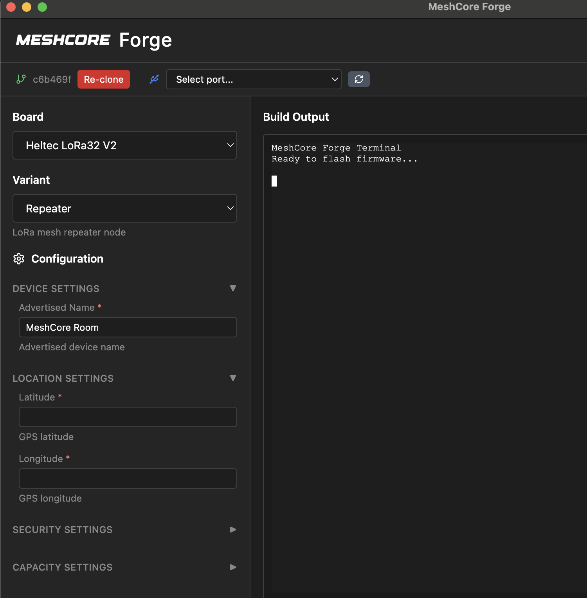

# MeshCore Forge

A cross-platform Electron application for building MeshCore firmware. Provides a GUI interface for configuring build flags, selecting boards and variants, and executing PlatformIO builds with bundled Python runtime.



## Download

**📦 [Download the latest release](https://github.com/awolden/meshcore-forge/releases)**

Pre-built binaries available for Windows, macOS, and Linux.

### macOS Security Note
If macOS shows a security warning about the app being from an "unidentified developer":
1. Right-click the app and select "Open" (instead of double-clicking)
2. Click "Open" in the security dialog that appears
3. The app will then open normally on future launches

This is expected behavior for unsigned applications and is safe to bypass.

## Features

- **Cross-platform support** - Windows, macOS, and Linux
- **Offline firmware compilation** - Bundled Python and PlatformIO
- **Board and variant selection** - Support for multiple hardware platforms
- **Real-time build output** - Terminal interface with xterm.js
- **Configurable build flags** - LoRa settings, WiFi credentials, and custom parameters
- **Post-processing support** - Board-specific firmware format conversion

## Supported Boards

- Heltec V3
- RAK4631
- And more...

## Supported Variants

- Companion BLE
- Companion WiFi
- Companion USB
- Repeater
- Room Server
- And more...

## Installation

### Prerequisites

- Node.js 18+ and Yarn
- Git

### Setup

1. Clone the repository:
   ```bash
   git clone https://github.com/your-org/meshcore-forge.git
   cd meshcore-forge
   ```

2. Install dependencies:
   ```bash
   yarn install
   ```

3. Bundle required resources:
   ```bash
   yarn bundle-resources
   ```

## Development

Start the application in development mode:
```bash
yarn start
```

## Building

Build for your current platform:
```bash
yarn build
```

Build for specific platforms:
```bash
yarn build-win    # Windows
yarn build-mac    # macOS
yarn build-linux  # Linux
```

## Project Structure

```
meshcore-forge/
├── electron/
│   ├── main.js              # Main process
│   ├── preload.js           # Preload script
│   └── platformio/          # PlatformIO manager
│       ├── manager.js       # PIO operations
│       └── config.js        # Build configurations
├── src/
│   ├── index.html
│   ├── renderer.js          # Renderer process
│   ├── styles.css
│   └── components/
├── resources/
│   ├── python/              # Portable Python (bundled)
│   ├── platformio/          # PlatformIO core (bundled)
│   └── meshcore/            # MeshCore repository (bundled)
├── scripts/
│   └── bundle-resources.js  # Resource bundling script
└── assets/                  # Application icons
```

## MeshCore Repository

This application builds firmware from the official MeshCore repository:
https://github.com/ripplebiz/MeshCore

## License

MIT License - see LICENSE file for details.